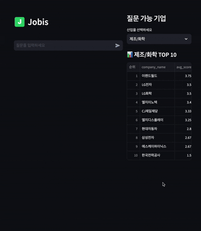

# Jobis – 기업 리뷰·면접 정보를 알려주는 RAG AI 챗봇

기업 리뷰, 면접 후기 등의 데이터를 기반으로  
구직자가 기업 정보를 쉽고 빠르게 이해하도록 돕는 **AI 기반 RAG 챗봇 서비스**입니다.

사용자는 기업명을 입력하거나 비교 질문을 던지면,  
Jobis 챗봇이 벡터 DB 기반 검색 + LLM 분석을 통해  
정확하고 친절한 요약 정보를 제공해줍니다.

> ⚠️ **데이터 안내**
>
> 본 프로젝트에서 사용된 기업 리뷰 및 면접 데이터는  
> 저작권 및 서비스 약관을 고려하여 **실제 데이터를 기반으로 구조만 유사하게 생성한 더미 데이터**입니다.
>
> 따라서 본 서비스의 목적은 특정 기업에 대한 사실 확인이 아니라,  
> **RAG(Retrieval-Augmented Generation) 파이프라인의 설계, 검색 품질 개선, 응답 생성 로직을 검증하는 데** 있습니다.
>
> 실제 데이터로 교체할 경우, 동일한 구조로 즉시 확장 가능한 형태로 설계되었습니다.

---

# 📌 주요 기능 소개

### ✅ **기업 리뷰·면접 기반 RAG 응답**
- 사용자 질문을 의미적으로 분석하여 관련 기업 리뷰/면접 데이터를 검색
- ChromaDB를 기반으로 한 문서 임베딩 검색  
- LangChain + Gemini 기반 LLM 요약 및 분석

### ✅ **기업 비교 분석 질문 지원**
예:
- 삼성전자 장점 알려줘
- 안진회계법인 면접 분위기는 어때?
- 국민연금공단은 워라밸이 좋은 회사야?
- 에스케이에코플랜트 단점이 뭐야?
- 웅진씽크빅은 장기적으로 다니기 괜찮은 회사야?

### ✅ **Streamlit 기반 웹 챗봇 UI**
- 사용자가 직접 질문을 입력하면 챗봇처럼 말풍선 UI로 대화  
- 답변은 글자-by-글자 **typing animation** 효과 제공
- 로고 삽입 + 사용자/챗봇 말풍선 스타일링 추가

---

# 🎬 데모 영상


---


# 🛠 설치 방법 (Setup Guide)

Jobis는 Python 3.11 환경에서 개발되었습니다.

## 1) 저장소 클론

```bash
git clone https://github.com/<your-repo>/Jobis.git
cd Jobis
```
## 2) 가상환경 생성 및 활성화

### 🖥 macOS / Linux
```bash
python3.11 -m venv venv
source venv/bin/activate
```

### 🪟 Windows (PowerShell)
```bash
python3.11 -m venv venv
venv\Scripts\activate
```

### 🐍 Anaconda
```bash
conda create -n venv python=3.11
conda activate venv
```

## 3) 패키지 설치
```bash
pip install --upgrade pip
pip install -r requirements.txt
```
## 4) API Key 설정 (.env)

프로젝트 루트에 .env 파일 생성:
```bash
GOOGLE_API_KEY=YOUR_API_KEY
```


## 📂 프로젝트 구조

```yaml
Jobis/
├── data/
│   ├── sqlite/            # 산업별 기업 평점/순위 DB 저장
│   ├── raw/               # 더미 데이터(JSON) 저장
│   ├── processed/         # 전처리된 JSON 저장
│   └── chroma_db/         # 임베딩된 벡터DB 저장
├── rag/
│   ├── preprocessing.py   # 전처리
│   ├── embedding.py       # 임베딩 및 ChromaDB 구축
│   ├── vectorstore.py     # 벡터스토어 로딩
│   ├── retriever.py       # 문서 검색기
│   ├── pipeline.py        # RAG 체인 구축
│   └── chatbot.py         # 챗봇 클래스
├── ui/
│   └── app.py             # Streamlit 웹 UI
├── static/logo.png        # 프로젝트 로고
├── requirements.txt
└── README.md
```


## 🚀 실행 방법 (Run Project)

1) 데이터 전처리
```bash
python rag/preprocessing.py
```
2) 임베딩 생성 & 벡터 DB 구축
```bash
python rag/embedding.py
```

3) Streamlit 웹 서비스 실행
```bash
streamlit run ui/app.py
```
브라우저에서
👉 http://localhost:8501 접속


---

# 🔧 개발 환경 (Development Guide)

## 📦 의존성 설치

```bash
pip install -r requirements.txt
```

**주요 기술 스택**:
	•	Python 3.11
	•	Streamlit
	•	LangChain (langchain-core 0.3.x)
	•	ChromaDB
	•	SentenceTransformers
	•	Gemini API


### 🧪 테스트 방법

**Chroma 검색 테스트**:
```bash
python rag/check_preprocessing.py
```
**Chatbot 작동 확인**:
```bash
python -m rag.chatbot
```


### 📝 라이선스

본 프로젝트는 학습 및 포트폴리오 제출을 위해 제작되었으며,
기업 데이터는 직접 생성한 더미 데이터를 사용합니다.